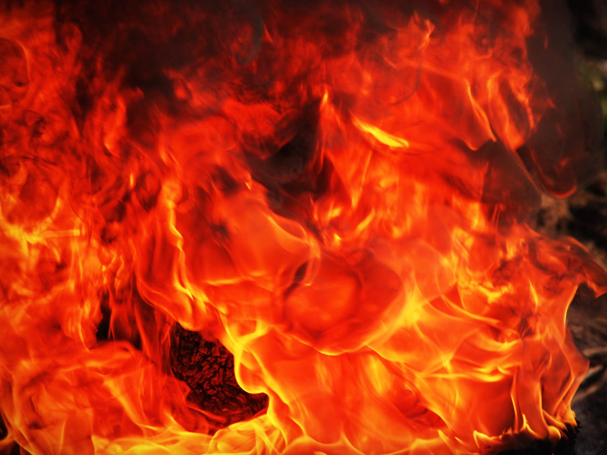
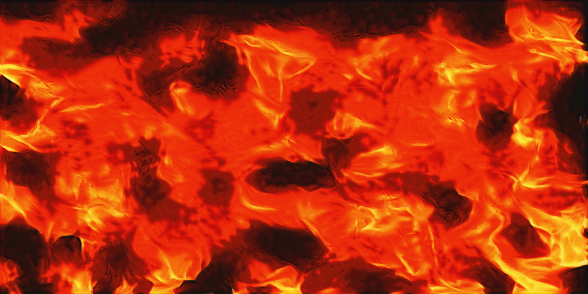
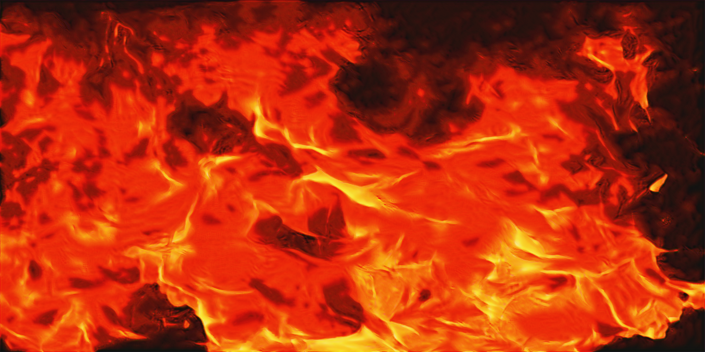
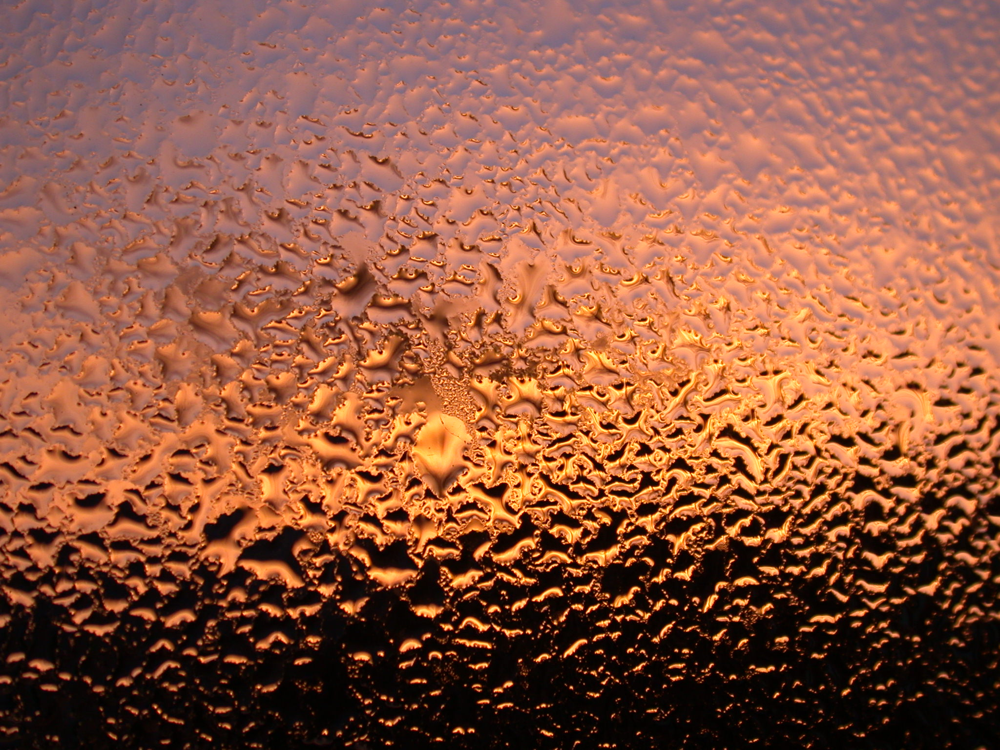
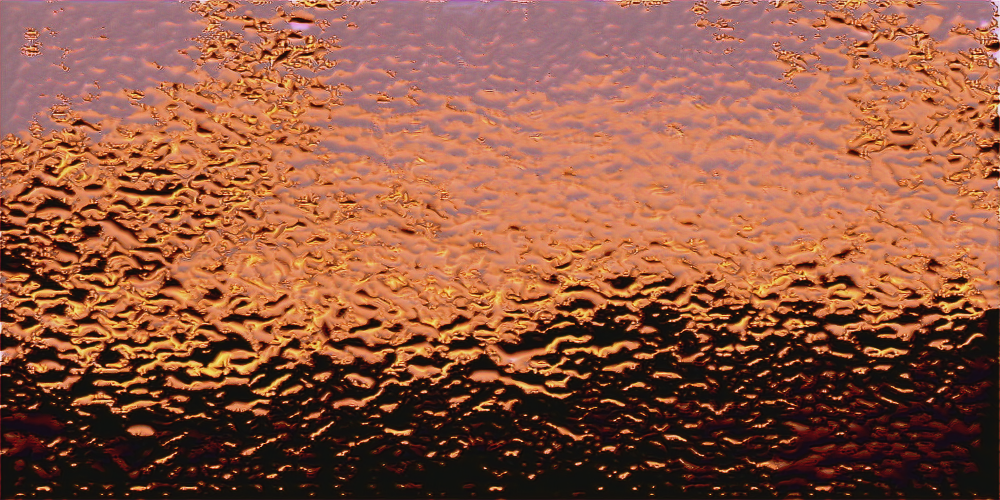
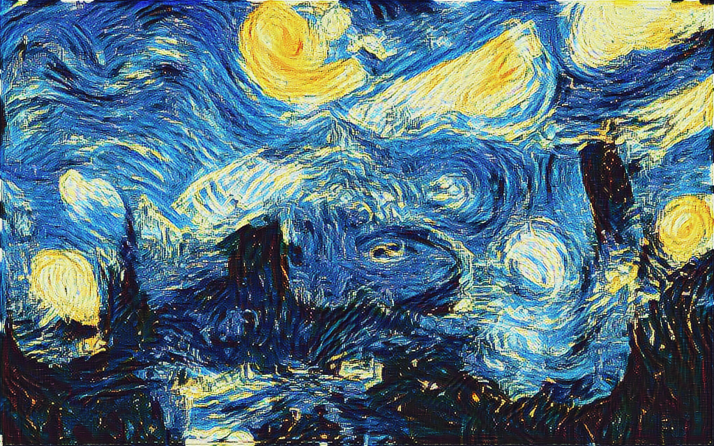
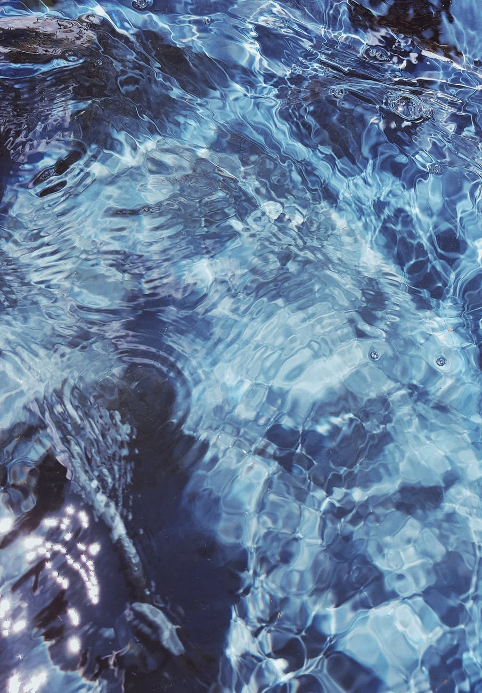
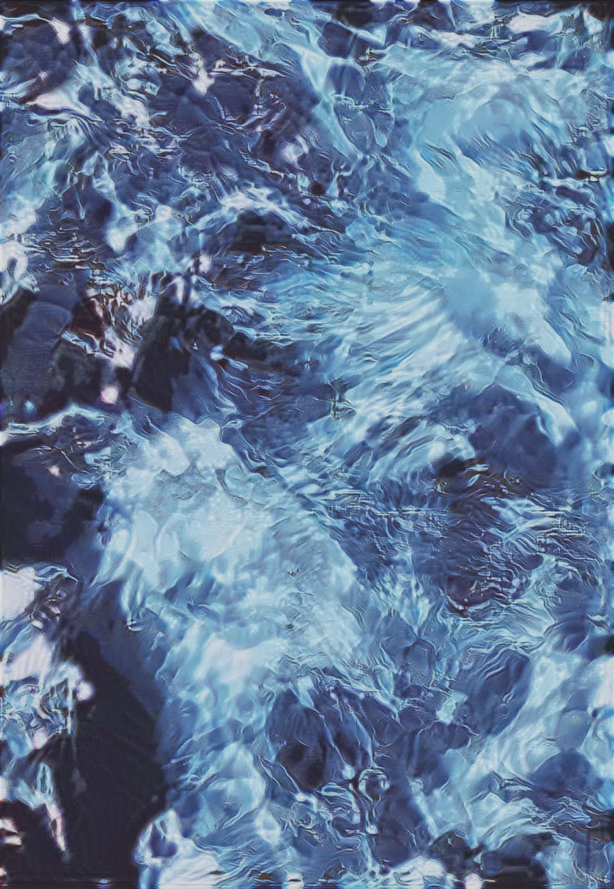
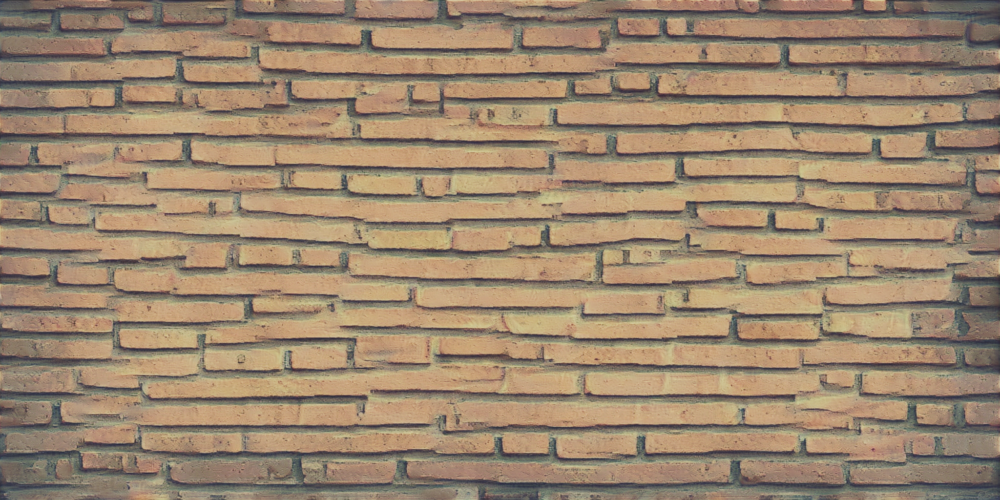

# multi_scale_deep_texture

This is a Tensorflow implementation of multi-scale  texture synthesis algorithm based on Gatys' deep texture algorithm in paper  [Texture Synthesis Using Convolutional Neural](http://papers.nips.cc/paper/5633-texture-synthesis-using-convolutional-neural-networks.pdf), and the ideas of synthesizing texture in a coarse-to-fine hierarchical pipeline by building image pyramid has been presented in Gatys' paper  [Controlling Perceptual Factors in Neural Style Transfer](http://openaccess.thecvf.com/content_cvpr_2017/html/Gatys_Controlling_Perceptual_Factors_CVPR_2017_paper.html).

The texture synthesis using CNNs proposed by Gatys can produce impressive results given an stochastic textures. However, when the texture image size is larger (e.g 2K, 4K and even higher resolution), the results will lack large scale structure and present as so-called _Texture soup_ due to the restriction of  receptive field size of VGG network. 

As will be shown below, the synthesis results using multi-scale pipeline will produce better results in maintain the large scale structure of texture. First, we down sample the texture sample image in size $[w,h]$ by a ratio 2 over $L-1$ times, thus build a $L$ layer image pyramid, in which the original texture image will be on $l_{L-1}$ layer, and the $L_0$ layer with minimum resolution $[\frac{w}{L-1}, frac{h}{L-1}]$. Second, we initial a noise image in size $[\frac{w}{L-1}, frac{h}{L-1}]$, and synthesize it by optimizing the Gram Loss computed with  texture sample in $l_{L-1}$ layer. Third, we up sample the synthesized texture by ratio 2, and continue to optimize the Gram Loss, until the current texture size reach target size.   

### Multi-scale synthesis pipeline is condusive to maintain the large scale structure

<table>
	<tr>
		<th><center> Texture image </center></th>
		<th><center> Synthesized image </center></th>
	</tr>
	<tr>
		<th rowspan='3' align="middle">
			<center></center>
		</th>
        <td align = "middle">
			<center></center>
            <center>L = 1</center>
		</td>
	</tr>
	<tr>
        <td align = "middle">
			<center></center>
            <center>L = 3</center>
		</td>
	</tr>
	<tr>
        <td align = "middle">
			<center></center>
            <center>L = 6</center>
		</td>
	</tr>
</table>


### Results

<table>
	<tr>
		<th><center> Texture image </center></th>
		<th><center> Synthesized image </center></th>
	</tr>
	<tr>
		<td>
			<center></center>
		</td>
        <td>
			<center></center>
		</td>
	</tr>
	<tr>
		<td>
			<center></center>
		</td>
        <td>
			<center></center>
		</td>
	</tr>
	<tr>
		<td>
			<center></center>
		</td>
        <td>
			<center></center>
		</td>
	</tr>
	<tr>
		<td>
			<center></center>
		</td>
        <td>
			<center></center>
		</td>
	</tr>
</table>


### Dependency
* python3.5
* tensoflow (tested on r1.4)
* VGG19 model weights download from the [TF-slim models](http://download.tensorflow.org/models/vgg_19_2016_08_28.tar.gz) 
* The code is tested on:
	* Ubuntu 16.04 LTS with CPU architecture x86_64 + Nvidia GeForce GTX 1080

### Recommended
* Ubuntu 16.04 with TensorFlow GPU edition

### Getting started 
Denote the directory of this repository as ```./multi_scale_deep_texture/``` 

* #### Download the VGG19 pre-trained model

```bash
# clone the repository from github
git clone https://github.com/LiaoQian1996/multi_scale_deep_texture.git
cd $multi_scale_deep_texture/

# download the vgg19 model weights from 
# http://download.tensorflow.org/models/vgg_19_2016_08_28.tar.gz
# to multi_scale_deep_texture/vgg19/
```
* #### Synthesis your texture image

modify the parameters in ``` run_syn.sh``` 

```bash
CUDA_VISIBLE_DEVICES=0 python main.py \
    --output_dir results \
    --target_dir ./imgs/fire.png \  # texture sample image path
    --texture_shape -1 -1 \         # texture shape will be as same as the sample image if [-1,- 1]
    --top_style_layer VGG54 \
    --max_iter 50 \
    --pyrm_layers 6 \
    --W_tv 0.001 \
    --vgg_ckpt ./vgg19/ \
    #--print_loss 
```
then run the shell script
```
sh run_syn.sh
```
